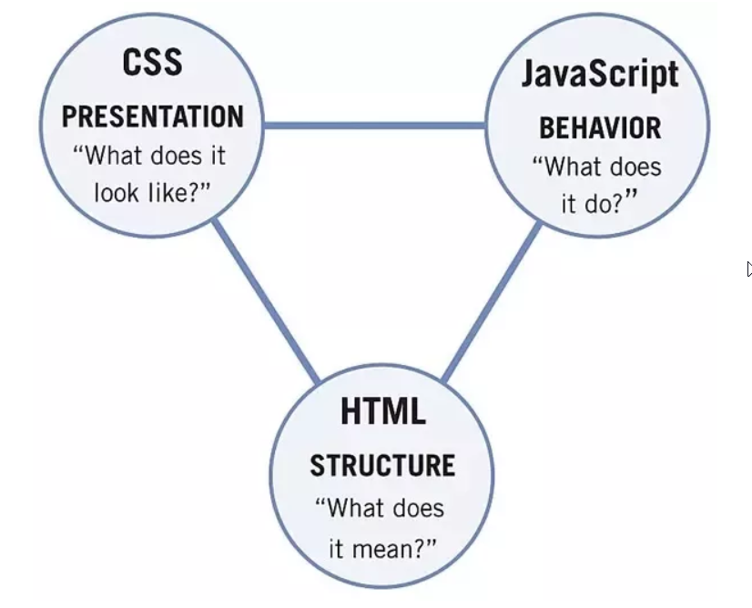

## What is cookies ?
Cookies are small files of information that a web server generates and sends to a web browser. Web browsers store the cookies they receive for a predetermined period of time, or for the length of a user's session on a website.
In simple terms, Cookies are small bits of data that are stored in your browser. 
 **Each browser will store them separately, so cookies in Chrome won't be available in Firefox.**
 There are many uses of cookies but most common are either session management or advertising (tracking cookies).
 
 #### Need
- As HTTP is stateless (Each request is independent and no state is tracked internally), cookies are used to keep track of this.
- They allow sites to keep track of data like what items you have in your shopping cart, who you are, what you've done on the website and more.
 
#### Attributes
Cookies can be broken down into several parts:
- name
- value
- expiry date
- path

The name identifies the cookie, the value is where data is stored, the expiry date is when the browser will get rid of the cookie automatically and the path determines what requests the cookie will be sent with.

#### Uses
Cookies are mainly used for three purposes:

**Session management**
Logins, shopping carts, game scores, or anything else the server should remember

**Personalization**
User preferences, themes, and other settings

**Tracking**
Recording and analyzing user behavior

## HTML
**H**yper**T**ext **M**arkup **L**anguage (HTML) is the language websites are written in. Elements (also known as tags) are the building blocks of HTML pages and tells the browser how to display content.

## CSS
It stands for "**C**ascading **S**tyle **S**heet." Cascading style sheets are used to format the layout of HTML pages. They can be used to define text styles, table sizes, and other aspects of Web pages.

## JavaScript
JavaScript (JS) is one of the most popular coding languages in the world and allows pages to become interactive. HTML is used to create the website structure and content, while JavaScript is used to control the functionality of web pages - without JavaScript, a page would not have interactive elements and would always be static. JS can dynamically update the page in real-time, giving functionality to change the style of a button when a particular event on the page occurs (such as when a user clicks a button) or to display moving animations.

