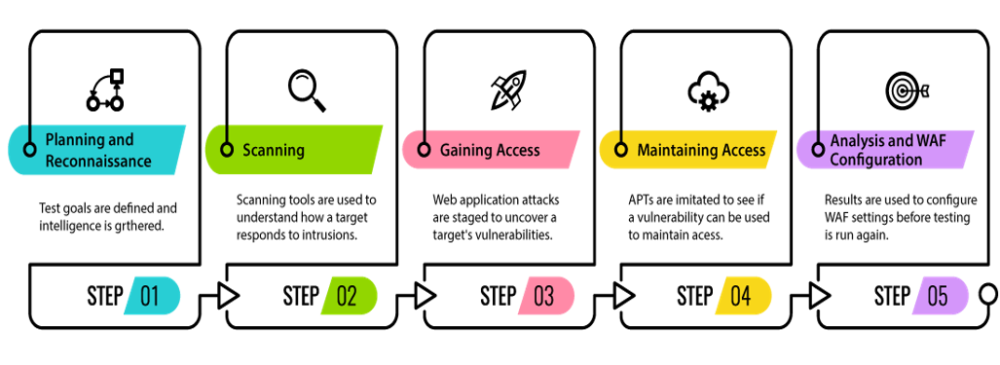

#### There are mainly 5 phases in hacking : 

### Reconnaissance:
Basically, it is the the first step of hacking. It is also known as Footprinting and information gathering Phase.
In this phase, we collect information about the target as much as possible. We usually collect information about:
- Network
- Host
- People involved
There are two types of Footprinting:
-->   **Active:** Directly interacting with the target to gather information about the target. Eg Using Nmap tool to scan the target   
-->   **Passive:** Trying to collect the information about the target without directly accessing the target. This involves collecting information from social media, public websites etc.

### Scanning:
In this phase, hackers are probably seeking any information that can help them perpetrate attack such as computer names, IP addresses, and user accounts.
Basically, at this stage, four types of scans are used:
1.  **Pre-attack**: Hacker scans the network for specific information based on the information gathered during reconnaissance.
2.  **Port scanning/sniffing**: This method includes the use of dialers, port scanners, and other data-gathering equipment.
3.  **Vulnerability Scanning**: Scanning the target for weaknesses/vulnerabilities.
4.  **Information extraction**: In this step, hacker collects information about ports, live machines and OS details, topology of network, routers, firewalls, and servers.

### Gaining Access:
This phase is where an attacker breaks into the system/network using various tools or methods. After entering into a system, he has to increase his privilege to administrator level so he can install an application he needs or modify data or hide data.

### Maintaining Access:
Hacker may just hack the system to show it was vulnerable or he can be so mischievous that he wants to maintain or persist the connection in the background without the knowledge of the user. This can be done using Trojans, Rootkits or other malicious files. The aim is to maintain the access to the target until he finishes the tasks he planned to accomplish in that target.

### Clearing Track
No thief wants to get caught. An intelligent hacker always clears all evidence so that in the later point of time, no one will find any traces leading to him. This involves modifying/corrupting/deleting the values of Logs, modifying registry values and uninstalling all applications he used and deleting all folders he created.
